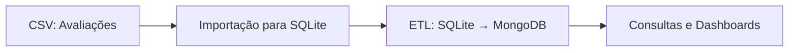

# Análise de Sentimento em Apps de Mensagem Instantânea
**Uma Arquitetura Híbrida e Integrada de Dados**

---

## 1. Contexto e Objetivo

- O projeto visa analisar avaliações de usuários de apps de mensagem, extraídas da Play Store.
- O desafio é transformar grandes volumes de dados textuais e estruturados em insights acionáveis para negócios e produto.
- **Objetivo central:** Demonstrar, na prática, a integração entre bancos de dados relacionais (SQLite) e NoSQL (MongoDB) em um pipeline de análise de sentimento.

---

## 2. Pipeline de Dados e Integração

**Fluxo Realizado:**
1. **Coleta:**  
   - Dados brutos em CSV (`mensageiros_processado.csv`).
2. **Importação e Estruturação:**  
   - Script automatizado importa o CSV para o SQLite, populando as tabelas `Aplicativos` e `Reviews` de forma relacional e sem duplicidade.
3. **ETL e Integração:**  
   - Um segundo script ETL lê os dados do SQLite e insere no MongoDB, mantendo a correspondência entre aplicativos e reviews.
   - O MongoDB passa a ser um espelho flexível do SQLite, pronto para análises NoSQL.
4. **Análise e Visualização:**  
   - Scripts Python geram gráficos e exportam dados para dashboards de BI.

**Diagrama do Fluxo:**

---

## 3. Estrutura dos Bancos

### **SQLite (Relacional)**
- Tabela `Aplicativos`: id_app (PK), nome
- Tabela `Reviews`: id_review_sqlite (PK), review_uuid, score, id_app (FK)
- **Vantagem:** Integridade, consultas SQL, fácil manutenção

### **MongoDB (NoSQL)**
- Coleção `aplicativos`: _id, nome
- Coleção `reviews`: _id, review_uuid, score, id_app, nome_app
- **Vantagem:** Flexibilidade, consultas textuais, escalabilidade

---

## 4. Scripts e Automação

- **importar_csv_para_sqlite.py:**  
  Automatiza a importação do CSV para o SQLite, garantindo unicidade dos aplicativos e vínculo correto das reviews.
- **etl_sqlite_to_mongodb.py:**  
  Sincroniza o SQLite com o MongoDB, permitindo análises híbridas e visualizações avançadas.
- **Scripts de gráficos:**  
  Geram visualizações a partir do SQLite, exportando para dashboards.

---

## 5. Benefícios da Integração

- **Consistência:**  
  O SQLite é a fonte da verdade, garantindo dados limpos e normalizados.
- **Flexibilidade:**  
  O MongoDB permite análises textuais e consultas não estruturadas.
- **Automação:**  
  Todo o fluxo é reproduzível e auditável via scripts.

---

## 6. Exemplos de Consultas

- **SQL (Quantitativo):**  
  Média de score por app, distribuição de sentimentos, ranking de apps.
- **MongoDB (Qualitativo):**  
  Busca de avaliações negativas sobre "interface", análise de sentimentos por palavra-chave.

---

## 7. Resultados e Insights

- WhatsApp lidera em satisfação, LINE apresenta maiores desafios.
- A integração dos bancos permitiu análises cruzadas e dashboards ricos.
- O pipeline pode ser facilmente adaptado para novos dados ou outros apps.

---

## 8. Conclusão

- O projeto demonstra, na prática, a integração real entre bancos de dados distintos.
- O uso combinado de SQLite e MongoDB potencializa a análise de dados, unindo robustez relacional e flexibilidade NoSQL.
- O pipeline automatizado garante escalabilidade e reprodutibilidade para futuras análises.

---

## 9. Próximos Passos

- Implementar análise de aspectos (ABSA).
- Tornar o ETL incremental.
- Explorar integrações com ferramentas de BI em tempo real. 